---

# 0. 目的

従来型システム構成と現代型システム構成を比較し、以下を目的とする。

* クラウドとオンプレミスの違いを理解すること
* 共通点を見つけ、本質を把握すること
* アプリケーション観点以外の知識の必要性を確認すること
* 興味を持つトピックを明確にすること

---

# 1. 従来型システム構成の例

## 1.1. 特徴

* **オンプレミス** : 初期費用が高く、機器選定や設置場所の確保が必要である。
* **モノリシック** : 単一サーバでシステム全体を構成する。
* **静的ネットワーク** : 固定されたIPアドレスとネットワーク構成である。

---

# 2. 現代型システム構成の例（クラウド）

## 2.1. 特徴

* **クラウド** : 従量課金制であり、柔軟に開始・終了が可能である。
* **マイクロサービス** : 機能ごとにサーバを分割して効率化を図る。
* **動的ネットワーク** : 自動スケールイン/アウトによりIPアドレスや構成が動的に変化する。

---

# 3. 比較

## 3.1. 差異の比較表

| 項目           | 従来型                     | 現代型                     |
| -------------- | -------------------------- | -------------------------- |
| インフラ       | 物理サーバ（オンプレミス） | クラウドまたはハイブリッド |
| アーキテクチャ | モノリシック               | マイクロサービス           |
| スケーリング   | 手動                       | 自動（オートスケール）     |
| 運用手法       | システム管理者依存         | DevOps、IaCでの自動化      |
| コスト構造     | 初期費用が高い             | 運用コスト中心             |

## 3.2. 現代構成のメリット

* **俊敏性** : 新機能やサービスを迅速に導入可能である。
* **スケーラビリティ** : 負荷変動への即時対応が可能である。
* **可観測性** : ログ管理やモニタリングが容易である。
* **高可用性** : 冗長性やフェイルオーバーを容易に実現できる。

## 3.3. クラウドとオンプレミスの共通点

従来型と現代型では多くの違いがあるように見えるが、以下の共通要素が存在する。

* サーバ（Server）
* ロードバランサ（LoadBalancer）
* DNS
* ファイアウォール（Firewall）

仮想化技術の普及やアーキテクチャの進化に伴い差異が顕著になる一方で、根本的な技術は共通しており、これがシステム設計の基盤となっている。

## 3.4. アプリ開発者が知るべき理由

インフラに関する知識はアプリ開発には不要と考えるかもしれないが、クラウドではインフラ構成が開発者の責任範囲となることが増えている。たとえば以下のような設定は、アプリ開発者が担当することが一般的である。

* Kubernetesクラスタのスケーリング設定
* データベースの冗長化構成
* ロードバランサの設定
* ファイアウォールの規則（インバウンド/アウトバウンド）

従来の「アプリ開発」と「インフラ運用」の境界が曖昧になっている現状では、インフラ知識を持つ開発者が求められている。そのため、既存技術の理解が重要である。

---

# 4. クラウドに挑む前に

クラウドといえど、すべてが新しい技術で構成されているわけではない。以下の基礎知識を押さえることで、スムーズに学習を進められる。

## 4.1. 基本的なITリテラシー

* **OS** : Linuxの基本操作（ファイル管理、コマンドラインの利用）
* **ネットワーク** : IPアドレス、DNS、HTTP/HTTPS、ポート番号の基本知識
* **プログラミング** : PythonやShellスクリプトなどの基本知識

## 4.2. ネットワーク基礎

* **TCP/IPモデル** : ネットワーク通信の仕組み
* **HTTP** : 通信の基本プロトコル
* **NATとファイアウォール** : セキュリティグループやルート設定の概念

## 4.3. 仮想化

* **コンテナ** : Dockerの基本概念
* **コンテナオーケストレーション** : Kubernetesの基礎

## 4.4. ストレージとデータ管理

* **ストレージオプション** : オブジェクトストレージ（例: AWS S3）
* **バックアップ** : 冗長化と復元の方法

## 4.5. セキュリティ

* **認証と認可** : OIDC/OAuth、SAMLの理解
* **暗号化** : SSL/TLSによる通信とデータの保護
* **RBAC** : 最小権限の原則（PoLP）の実践

## 4.6. DevOpsの基本

* **IaC** : TerraformやCloudFormationによる構成管理
* **CI/CD** : GitHub ActionsやJenkinsによる自動化
