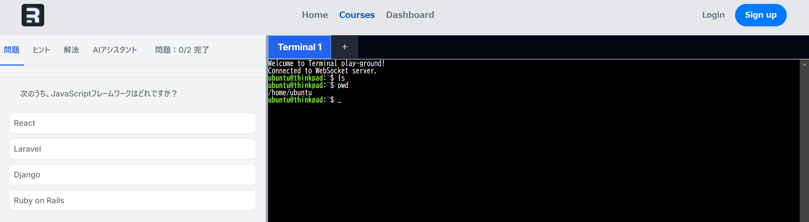

# Linuxのファイル操作を学ぼう

以下のようなブラウザ上でLinuxのterminalに接続することのできるアプリをクラウド上にデプロイし、そこでハンズオン演習を行う。
（問題形式にしたかったが、時間が取れなかったため断念）


## 1. ファイル・ディレクトリ操作の基本

### ls: ファイル・ディレクトリの一覧表示
```sh
ls        # 現在のディレクトリのファイル一覧を表示
ls -l     # 詳細情報を表示
ls -a     # 隠しファイル（.で始まるファイル）も表示
```

### cd: ディレクトリの移動
```sh
cd /path/to/directory  # 指定のディレクトリへ移動
cd ..                  # 一つ上のディレクトリへ移動
cd ~                   # ホームディレクトリへ移動
```

## 2. ファイルの内容を表示するコマンド

### cat: ファイルの内容を一気に表示
```sh
cat filename.txt  # ファイルの内容を全て表示
```

### more: ファイルの内容をページごとに表示
```sh
more filename.txt  # スペースキーで次のページへ移動
```

### less: moreより高機能なページャー
```sh
less filename.txt  # 上下キーでスクロール可能
```

### cat と more/less の違い
- `cat` は一度に全ての内容を表示（長いファイルだと見づらい）
- `more` はページ単位で表示、`less` はスクロールが可能

## 3. 指定した行数の表示

### head: 先頭の行を表示
```sh
head -n 10 filename.txt  # 先頭10行を表示（デフォルトは10行）
```

### tail: 末尾の行を表示
```sh
tail -n 10 filename.txt  # 末尾10行を表示（デフォルトは10行）
```

### tail -f: ファイルのリアルタイム監視
```sh
tail -f /var/log/syslog  # ログファイルなどをリアルタイムで監視
```

## 4. リダイレクト（標準出力をファイルに書き込む）

### 上書き（`>`）
```sh
echo "Hello, World!" > file.txt  # ファイルに書き込む（上書き）
```

### 追記（`>>`）
```sh
echo "追加の内容" >> file.txt  # 既存のファイルに追記
```

## 5. grep: 文字列検索

### 基本的な使い方
```sh
grep "検索文字列" filename.txt  # ファイル内から指定の文字列を検索
```

### よく使うオプション
```sh
grep -i "text" filename.txt   # 大文字小文字を区別しない
grep -n "text" filename.txt   # 行番号を表示
grep -v "text" filename.txt   # 指定の文字列を含まない行を表示
grep -3 "text" filename.txt   # 前後3行も表示する
```

### パイプと組み合わせる例
```sh
ls -l | grep "txt"     # lsの出力から"txt"を含む行を検索
dmesg | grep "error"  # システムログから"error"を検索
```

---


